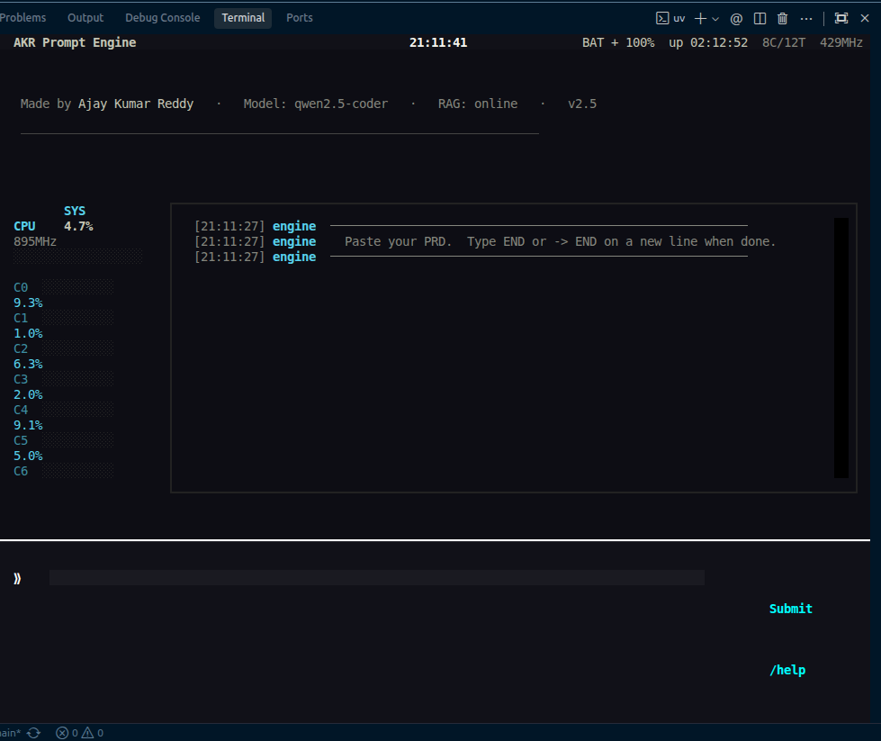

# 🚀 Prompt Machine (Ajayakr-prompter)

Prompt Machine is an intelligent, CLI-based UI Designer and Code Generator pipeline. It uses a local LLM through [Ollama](https://ollama.ai/) combined with a local FAISS-based Vector Knowledge Base to intelligently architect and generate production-quality React + Tailwind CSS components from a simple Product Requirements Document (PRD).

 *(Note: To capture a screenshot of the dashboard, run `uv run machine.py run promptmachine` and use your system capture tool)*

## ✨ Key Features

- **PRD Validation & Intent Extraction:** Intelligently reads your PRD and extracts product type, key features, target audience, style keywords, and tone.
- **Automated Page Planning:** Sets up a layout sequence (e.g., Navbar, Hero, Features, Footer) based on the inferred product type.
- **Smart Palette Selection:** Automatically selects comprehensive, beautiful Tailwind color palettes (e.g., 'Midnight Dev', 'Neo-Brutalist', 'SaaS Architecture') mapped to your desired tone.
- **RAG for UI Components:** Retrieves real-world, high-quality reference patterns (from Uiverse, FreeFrontend, Aceternity UI, React Bits, and more) from its FAISS vector database to ensure output code relies on verified solutions.
- **CPU-First Embedding & GPU-First LLM:** Keeps embeddings strictly on the CPU, allowing the Ollama LLM dedicated access to your GPU for maximum performance.
- **Zero-Dependency Output:** Produces single-file, copy-paste-ready React functional components styled exclusively with Tailwind CSS utility classes.
- **Stunning Textual Dashboard:** A full TUI dashboard mimicking `btop` for resource monitoring, built entirely in terminal with `psutil`, `textual` and `rich`.

## 🏗️ Architecture & Pipeline Flow

Prompt Machine is structured as an 11-stage compiler pipeline that transforms raw text into a fully synthesized React component:

1. **Intent Parsing:** LLM interprets the PRD to extract tone, features, and audience.
2. **Ontology Mapping:** Maps the requested intent to standard UI component types (Navbar, Hero, Testimonials, etc.) using embedding similarity.
3. **Layout Planning:** Arranges the selected components logically into a coherent page structure.
4. **Blueprint Generation:** Generates an Abstract Syntax Tree (AST) representing the UI blueprint.
5. **Blueprint Validation:** Strictly checks the generated AST to ensure it contains required components and standard structure.
6. **Targeted Retrieval (RAG):** Queries the FAISS Vector Knowledge Base to retrieve relevant codebase context for the specific requested components.
7. **Design System Integration:** Infuses a cohesive Tailwind color palette and typography schema based on inferred intent.
8. **Prompt Synthesis:** Compiles all context (intent, layout, blueprint, kb context, design) into a massive, highly optimized prompt.
9. **Code Generation:** The primary LLM generates the complete React + Tailwind component.
10. **Blueprint Output:** Renders the final codebase and structured metadata into the output directory.
11. **Strict Code Validation:** Ensures the React structure and Tailwind tokens comply with being accurate and following the design system.

## 📁 Project Structure

- `machine.py`: Main generation pipeline orchestrator.
- `pipeline/`: Contains the modular 11-stage pipeline components.
- `vector_kb.py`: Tool to build the FAISS vector index, chunk data, and execute semantic queries.
- `Scrapper/` & `Scrapped-Data/`: Python scripts (`scraper_uiverse.py`, `splitter.py`) used to extract high-quality UI components and code snippets from external libraries.
- `ui/`: Contains the Textual Dashboard TUI classes (`dashboard.py`).
- `vector-kb/`: Stores the generated FAISS similarity search index (`index.faiss`).
- `output/`: Where generated React files (`.jsx`) and detailed LLM prompts (`.md`) are saved.

## ⚙️ Prerequisites

- [Ollama](https://ollama.ai/) running locally for LLM code generation.
- **Python ^3.10**
- [uv](https://docs.astral.sh/uv/) for incredibly fast and reliable dependency management.

### Model Requirements

By default, the pipeline uses `qwen2.5-coder` (or `llama3.1`). Make sure you have your preferred coding model pulled:
```bash
ollama pull qwen2.5-coder
```

## 🚀 Setup & Usage

### 1. Install Dependencies
Using `uv` to sync the environment and handle dependencies:
```bash
uv sync
```

### 2. Build the Vector Knowledge Base (RAG)
The vector knowledge base uses `BAAI/bge-small-en-v1.5` sentence embeddings and FAISS to enable fast retrieval. You only need to build this once (or when you add more scraped components).
```bash
uv run vector_kb.py build
```

*To test the knowledge base manually:*
```bash
uv run vector_kb.py query
```

### 3. Run the Prompt Machine Pipeline

Start your locally installed Ollama instance if it isn't running:
```bash
ollama serve
```

**To launch the interactive TUI Dashboard (Recommended):**
```bash
uv run machine.py run promptmachine
```

**To launch the standard CLI pipeline:**
```bash
uv run machine.py run Ajayakr-prompter
```

You can optionally override the LLM model and design palette:
```bash
uv run machine.py run Ajayakr-prompter --model=qwen2.5-coder --palette=P-4
```

### 4. Provide Your PRD

When prompted (or within the dashboard's input area), paste your Product Requirements Document (PRD).

**Example PRD:**
```markdown
I need a modern SaaS landing page for an AI accounting tool called 'LedgAI'.
Target audience: Freelancers and small businesses.
Tone: Professional, very clean, highly trustworthy, high-tech, slightly futuristic.
Key Features: Auto-invoicing, AI expense categorization, tax estimates.
Color Preference: Dark mode, violet and slate accents.
```
Type `END` on a new line and press Enter to begin the CLI pipeline, or click `[Submit]` in the TUI to send the request from the dashboard.

### 5. Review the Output

The system will parse the PRD, retrieve matching component patterns, and synthesize the final structured codebase.
Check the `output/` directory for your generated React file (`.jsx`), the exact blueprint AST, and the detailed LLM prompt (`.md`) used to create it.
